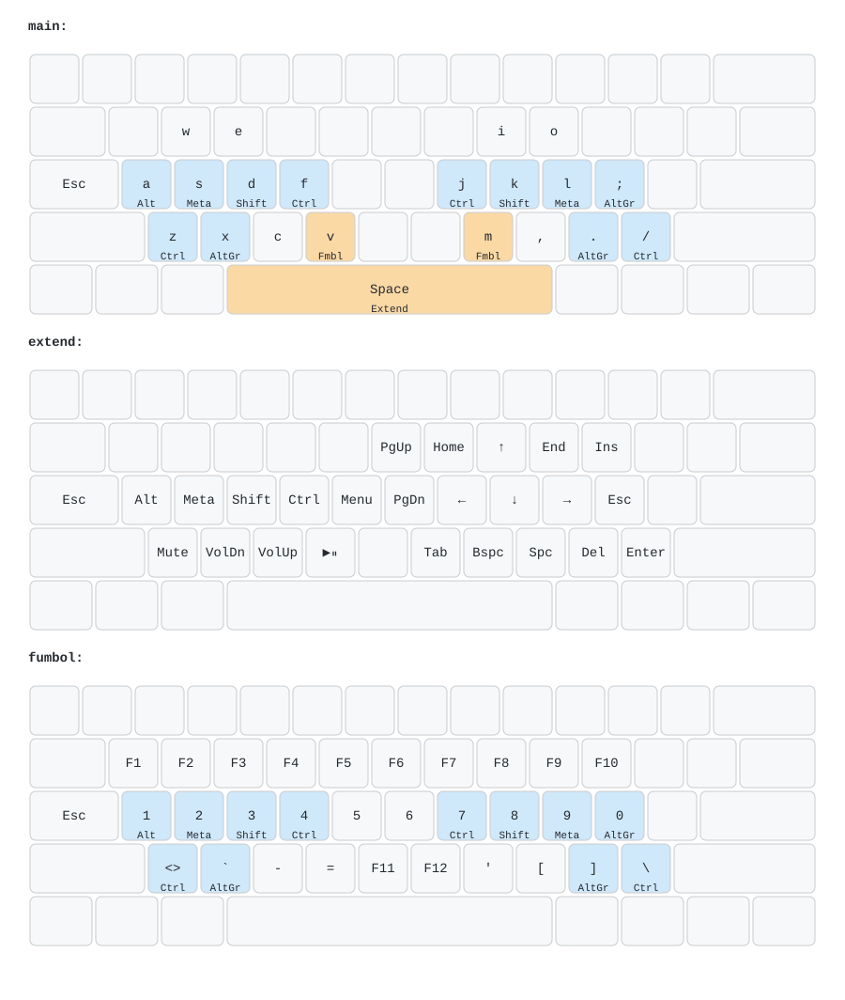

<p align="center">
  
</p>

<h1 align="center">Kenkyo (fork)</h1>

<p align="center">
  <strong>A minimal, ergonomic, 31-key layered keyboard layout for Kanata.</strong>
</p>

<p align="center">
  <a href="#license"></a>
  <a href="https://github.com/jtroo/kanata"></a>
</p>

---

This is my personal fork of [argenkiwi/kenkyo](https://github.com/argenkiwi/kenkyo), trimmed down to just the
[Kanata](https://github.com/jtroo/kanata) config I actually use, with a few tweaks to the home row mods and the
Space/Extend behavior. See [Differences from upstream](#differences-from-upstream) below; everything else about the
layout (chords, Fumbol layer, design philosophy) is inherited from the original project and its README.

## Repository Structure

```text
.
├── kanata/
│   └── kanata.kbd       # Kanata configuration (Windows, macOS, Linux)
├── keymap-drawer/
│   ├── kenkyo.yaml      # Hand-maintained keymap-drawer source (see draw.sh)
│   ├── draw_config.yaml # Color styling for the generated diagram
│   ├── draw.sh          # Regenerates kenkyo.svg
│   └── kenkyo.svg        # Layout diagram, kept up to date with kanata.kbd
├── notes/               # Design notes
├── images/              # Logo
├── LICENSE
└── README.md
```

## Getting Started

1. Install [Kanata](https://github.com/jtroo/kanata#installation) for your operating system.
2. Run Kanata pointing to the configuration file in this repository:
   ```bash
   kanata -c kanata/kanata.kbd
   ```

## Layout

<p align="center">
  
</p>

Run `keymap-drawer/draw.sh` to regenerate the diagram above after editing `kanata/kanata.kbd` — it's hand-maintained
rather than parsed from the config, since keymap-drawer's Kanata support is experimental and doesn't resolve
`defchords`/`deftemplate`/`defvar`. Update `keymap-drawer/kenkyo.yaml` to match any binding changes by hand.

## Differences from upstream

- **Home row mods swapped:** `A`/`;` are now Alt and `S`/`L` are now Meta (Super), the opposite of upstream's
  assignment. Purely a personal preference for which thumb-adjacent key does which modifier.
- **Space no longer misfires into Extend while typing fast:** upstream used the same "flowtap" fast-typing guard on
  Space as on the letter mods (600ms streak window). This fork gives Space its own, much shorter 150ms window
  (`streak-time-spc`), so a normal typing burst doesn't accidentally trigger the Extend layer, while a deliberate
  hold still does.
- **Holding Space (or a home row mod) no longer falls back to repeating the key:** upstream's `charmod` used
  `tap-hold-release-timeout`, which re-emits the tapped character if you hold past the timeout without pressing
  another key (letting you auto-repeat by holding, e.g. holding `A` types `aaaa...`). This fork switches to plain
  `tap-hold-release`, so once the hold timeout elapses the modifier/layer engages and *stays* engaged until release
  — no more accidental letter repeats from holding a home row key a beat too long. The trade-off is you lose
  key-repeat-by-holding on those keys.
- **Extend layer navigation keys reshuffled:** `Y`/`U`/`I`/`O`/`P` and `H`/`;` were rearranged (e.g. `PgUp` moved from
  `P` to `Y`, `Esc` moved from `H` to `;`) to better match this fork's muscle memory; functionally equivalent to
  upstream, just remapped to different fingers.

## License

Distributed under the MIT License. See [`LICENSE`](LICENSE) for more details.
